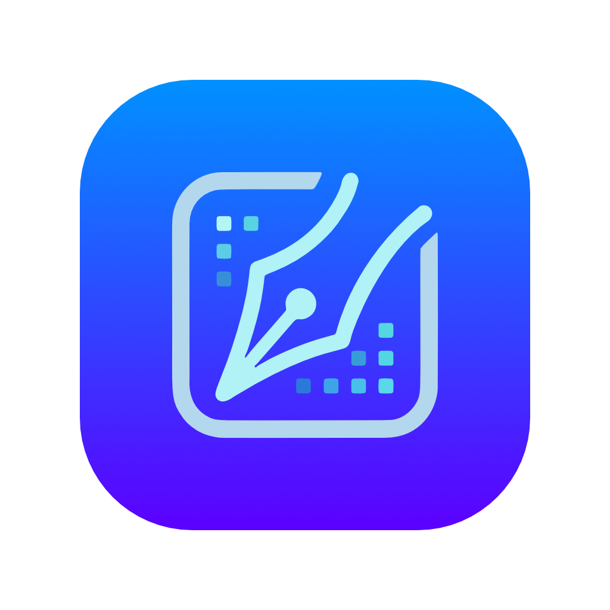

<div align="center">



# InkNel

**思考を整理する Markdown メモアプリ**

書くことに集中できるデスクトップ Markdown エディタ。シンタックスハイライト・プラグイン拡張・AI 連携・ZIP バックアップを搭載した、あなただけの執筆環境。

[](https://inknel.ary-ap.com)
[](#ダウンロード)
[](#)

[ダウンロード](#ダウンロード) ·
[機能](#主な機能) ·
[使い方](#使い方) ·
[プラグイン](#プラグインシステム) ·
[開発](#開発)

</div>

---

## 概要

InkNel は **Markdown を一級市民として扱う** ローカルファースト Markdown メモアプリです。すべてのノートは `.md` ファイルとしてディスクに保存され、他のエディタとの互換性を保ちながら、リッチなプレビュー・AI 補助・拡張可能なプラグインアーキテクチャを提供します。

- **書くことに集中**: CodeMirror 6 ベースの高速エディタ + リアルタイムプレビュー
- **拡張自在**: リモートカタログからプラグインを取得 → インポート → 利用
- **AI 連携**: ChatGPT / Claude / Copilot を選択してプロバイダごとに設定保存
- **データは手元に**: ノートはすべて `.md`、画像と添付ファイルは保存先フォルダで管理
- **完全バックアップ**: 保存先を ZIP に固めて任意の場所に退避、リストアで完全復元

## 主な機能

### Markdown エディタ
- **40+ 言語のシンタックスハイライト**: JavaScript / TypeScript / Python / Go / Rust / Bash / SQL / YAML / JSON / HTML / CSS など
- **コードブロックの行番号表示**、ワンクリックコピー
- **タスクリスト**: `- [ ] / - [x]` をチェックボックスとして描画、クリックで状態切替
- **画像 / 添付ファイル**: ドラッグ＆ドロップで挿入、サムネイル生成、PDF プレビュー
- **見出しアンカーリンク**、外部 URL を OS ブラウザで開く

### フォルダ &amp; タグ
- **仮想フォルダ**: サイドバーで階層管理（ノートのメタ情報に保存）
- **タグ**: クロス分類、タグ一覧から横断検索
- **全文検索**: タイトル / 本文 / タグから瞬時に検索

### AI アシスト
- **マルチプロバイダ対応**: 一般的な AI (OpenAI 互換) / ChatGPT / ClaudeCode / Copilot
- **プロバイダごとに独立した設定**: Token / Endpoint / Model を別々に保存、タブで切替
- **AI チャットパネル**: ノートと連動した対話、Markdown レンダリング、入力履歴 (↑↓ で過去入力呼び戻し)
- **AI 要約 / 整形**: 見出し別要約・箇条書き整理・コードブロック改善・表整形・HTML → Markdown 変換

### プラグインシステム
- **リモートカタログから取得**: `inknel.ary-ap.com/plugins/plugins.json` を参照
- **ダウンロード &amp; インポートの 2 段階**: ファイル取得とランタイム登録を明確に分離
- **ランタイム読み込み**: 取得した JS プラグインを Blob URL 経由で動的 import
- **削除可能**: UI から完全に取り除く、再ダウンロードで復活

### バックアップ &amp; リストア
- **ZIP バックアップ**: `notes/` / `images/` / `attachments/` を 1 ファイルにアーカイブ
- **リストア**: ZIP を選んで展開、DB を MD ファイルから完全再構築
- **iCloud / Dropbox / Google Drive 互換**: 保存先フォルダをクラウド同期領域に置けば自動で複数端末共有

### その他
- **ダーク &amp; ライトモード**: 全体テーマ切替
- **タブ管理**: 複数ノートを同時に開き、再起動時に復元
- **ペイン分割**: ノートとプレビューを横並びで表示
- **ノート保護機能**: パスワードでロックして他人に見られないように
- **シークレットノート**: 表示にもパスワードが必要な完全秘匿モード

## ダウンロード

最新版は公式サイトから:

> 🌐 **https://inknel.ary-ap.com**

または直接 DMG をダウンロード:

> ⬇️ **[InkNel-0.2.14-arm64.dmg](https://inknel.ary-ap.com/download/InkNel-0.2.14-arm64.dmg)** (Apple Silicon / Notarized)

### 対応プラットフォーム

| OS | ステータス |
|---|---|
| macOS (Apple Silicon) | ✅ Notarize 済み、公式提供中 |
| macOS (Intel x64) | 🚧 ビルド可能、配布は未対応 |
| Windows | 🚧 準備中（リポジトリには `dist:win:zip` スクリプトあり） |
| Linux | ❌ 未対応 |

### インストール (macOS)

1. DMG をダウンロード
2. ダブルクリックで開く
3. `InkNel.app` を `Applications` フォルダにドラッグ
4. Launchpad または Spotlight から起動

公証 (Notarization) 済なので初回起動時に Gatekeeper 警告は出ません。

## 使い方

### 起動 &amp; 最初のノート

1. アプリ起動後、サイドバー上部の **「+ 新規ノート」** をクリック
2. タイトルを入力し、本文を Markdown で書く
3. 自動保存（デバウンス）でディスクに反映

### 保存先の設定

既定では `~/Library/Application Support/InkNel/` (macOS) に保存されます。**iCloud Drive / Dropbox / Google Drive** のフォルダを保存先に指定すれば、複数端末で同期できます。

`設定 > 保存先 > フォルダを選択` から変更可能。変更後は **「データを上書き」** ボタンで既存ノートを新保存先に書き出します。

### AI 連携

1. `設定 > AI` で利用するプロバイダを選択（タブ式）
2. API Token と必要に応じて Endpoint / Model を入力
3. ノート画面右上の **AI チャット** ボタンで対話、**AI 要約** ボタンで自動整形

### プラグイン取得

1. `設定 > プラグイン` を開く（自動でカタログ取得）
2. プラグインストア欄に表示されたプラグインの **「ダウンロード」** ボタンをクリック
3. インストール済み欄に現れたプラグインの **「インポート」** ボタンでランタイム登録
4. トグルを ON にして有効化

例: Mermaid プラグインを入れると ` ```mermaid ` コードブロックがシーケンス図 / フローチャート / ER 図として描画されます。

### バックアップ &amp; リストア

- **バックアップ**: `設定 > バックアップ > バックアップを作成`
  - DB ↔ MD 同期 → ZIP 圧縮 → 保存ダイアログで任意の場所に書き出し
- **リストア**: `設定 > リストア > リストアを実行`
  - ZIP を選択 → 既存ファイル置換 → DB を MD から完全再構築

### キーボードショートカット

| 操作 | macOS |
|---|---|
| 新規ノート | `⌘ N` |
| 検索 | `⌘ F` |
| 置換 | `⌘ Shift F` |
| 設定を開く | `⌘ ,` |
| 印刷 / PDF 書き出し | `⌘ P` |
| AI チャット送信 | `Enter` |
| AI チャット改行 | `Shift + Enter` |
| AI チャット中断 | `Esc` |
| AI チャット履歴 (↑/↓) | `↑` / `↓` (1 行目で) |

## プラグインシステム

InkNel のプラグインは **ローカル JS ファイル + リモートカタログ** で構成されます。

### プラグインの形式

各プラグインは ES module の `.js` ファイルで、以下の export を提供できます:

```js
export const manifest = {
  id: 'mermaid',
  label: 'Mermaid',
  description: '...',
};

// fenced code block の言語別カスタム描画
export const renderFence = ({ code, lang, escapeHtml }) => { ... };

// プレビュー HTML 描画後の DOM 後処理
export const renderInPreview = async (root, { theme }) => { ... };

// テーマ切替時などのリセット
export const resetInPreview = (root) => { ... };
```

### プラグインの保存先

ダウンロードしたプラグインは:
- **macOS**: `~/Library/Application Support/InkNel/plugins/`
- **Windows**: `%APPDATA%\InkNel\plugins\`
- **Linux**: `~/.config/InkNel/plugins/`

に `<id>.json` (manifest) と `<id>.js` (本体) として保存されます。

## 開発

### 必要環境

- macOS (開発は Apple Silicon 推奨)
- Node.js 20+
- Apple Developer 証明書（Mac ビルド時 / Notarization 用）

### セットアップ

```bash
git clone https://github.com/akirat28/InkNel_Elec.git
cd InkNel_Elec
npm install
npm run dev
```

### ビルド

```bash
# Mac arm64 (Notarize 用に .env で APPLE_ID / APPLE_APP_PASSWORD を設定)
npm run dist:mac:arm64

# Mac universal
npm run dist:mac:universal

# Windows (zip)
npm run dist:win:zip
```

### 主要技術

| レイヤ | 技術 |
|---|---|
| デスクトップ | Electron 32 |
| ビルド | electron-vite (Vite 5) + electron-builder 26 |
| エディタ | CodeMirror 6 |
| Markdown | markdown-it + highlight.js |
| 永続化 | better-sqlite3 + ファイルシステム (.md) |
| UI | React 18 + TypeScript 5 |
| ZIP | adm-zip |
| 拡張 | Plain JS ESM (Blob URL 経由で dynamic import) |

### ディレクトリ構成

```
InkNel_Elec/
├── electron/           # Main プロセス (Node.js)
│   ├── db/             # SQLite スキーマ・クエリ
│   ├── storage/        # .md / 画像 / 添付 / プラグイン / バックアップ
│   ├── sync/           # クラウド同期
│   ├── utils/          # YAML front-matter パーサ等
│   ├── ipc.ts          # ipcMain ハンドラ定義
│   ├── preload.ts      # contextBridge 公開 API
│   └── main.ts         # アプリエントリ
├── src/                # Renderer プロセス (React)
│   ├── components/     # 各 UI コンポーネント
│   ├── plugins/        # プラグインレジストリ + ランタイムローダ
│   ├── styles/         # global.css
│   ├── utils/          # マークダウン処理など
│   ├── settings.ts     # 設定スキーマ + マイグレーション
│   ├── App.tsx
│   └── main.tsx
├── scripts/            # ビルド / 署名 / 公証用 cjs スクリプト
├── web-site/           # 公式 LP + プラグインカタログホスト
└── docs/               # 仕様書 / インストールガイド
```

## ライセンス

InkNel は現時点ではプロプライエタリ配布です。ライセンス条項は別途案内予定。

---

<div align="center">

🌐 [公式サイト](https://inknel.ary-ap.com) ·
🐛 [Issues](https://github.com/akirat28/InkNel_Elec/issues) ·
💬 [Discussions](https://github.com/akirat28/InkNel_Elec/discussions)

Made with care · Markdown thinking, beautifully crafted.

</div>
